# 🚀 CCI AL Colombia — Static to Dynamic Migration Plan

> **Date:** February 21, 2026
> **Status:** PLAN — No code changes until approved
> **Current stack:** Static HTML + Bootstrap 5 (Mobirise)
> **Target stack:** Next.js + Node.js/Express + PostgreSQL

---

## 📋 Table of Contents

1. [Executive Summary](#1-executive-summary)
2. [What Can Be Made Dynamic](#2-what-can-be-made-dynamic)
3. [Proposed Architecture](#3-proposed-architecture)
4. [Database Design](#4-database-design)
5. [Authentication & Roles](#5-authentication--roles)
6. [Frontend Plan](#6-frontend-plan)
7. [Backend Plan (API)](#7-backend-plan-api)
8. [Admin Panel — What Each Role Can Do](#8-admin-panel--what-each-role-can-do)
9. [Migration Phases](#9-migration-phases)
10. [Technology Justification](#10-technology-justification)
11. [Hosting & Deployment](#11-hosting--deployment)

---

## 1. Executive Summary

The goal is to transform this **static Mobirise website** into a **dynamic web application** where authorized users can log in with personal credentials, and administrators can update content directly from the browser — without touching HTML files.

### Current Problems Solved by This Migration

| Problem | Solution |
|---------|----------|
| Hardcoded password shared by all users | Individual accounts with hashed passwords |
| Client-side auth (sessionStorage) | Server-side JWT authentication |
| Content changes require editing HTML | Admin panel with online editor |
| No user management | User registration, roles, and permissions |
| No data persistence | PostgreSQL database |
| Stock images and placeholders | CMS-style image upload system |

---

## 2. What Can Be Made Dynamic

After analyzing every page, here is a map of **every content area** that can be stored in the database and edited online:

```mermaid
mindmap
  root((CCI AL Colombia))
    Inicio
      Hero image
      Welcome text
      Photo gallery (6 images)
      Vision & Mission text
    Exclusivo
      Courses catalog
        Title, subtitle, description
        Course image
        Display order
      Workshops section
        Title, subtitle, description
        Workshop image
    Comunidad
      Intro text and image
      Fincas (Name, Location, Contact)
      Transporte (providers)
      Juegos con Propósito
      Cocina (recipes, tips)
      Gráficos (templates)
      Testimonials
    CampaTienda
      Store header text and banner
      Products (image, name, description, price)
    Equipados
      Video embeds (YouTube URLs)
      Video descriptions
    Global
      Navigation menu links
      Footer info (social links, copyright)
      Site settings (logo, site name)
```



### Detailed Content Inventory

| Page | Section | Dynamic Content | Admin Action |
|------|---------|----------------|--------------|
| **index.html** | Hero | Banner image, welcome text | Edit text and swap image |
| **index.html** | Login | — | Managed via Auth system |
| **inicio.html** | Gallery | 6 gallery images + captions | Add, remove, reorder images |
| **inicio.html** | Vision & Mission | Text paragraphs | Edit rich text |
| **exclusivo.html** | Courses | 5 course cards (image, title, subtitle, description) | CRUD operations |
| **exclusivo.html** | Workshops | 4 workshop cards (image, title, subtitle, description) | CRUD operations |
| **equipados.html** | Videos | YouTube embed URLs + descriptions | Add, edit, remove videos |
| **comunidad.html** | Fincas | Name, location, contact (currently empty cards) | CRUD operations |
| **comunidad.html** | Transporte | Service name, contact, details | CRUD operations |
| **comunidad.html** | Juegos | Game name, description, rules | CRUD operations |
| **comunidad.html** | Cocina | Recipe name, instructions, tips | CRUD operations |
| **comunidad.html** | Gráficos | Template name, downloadable file | Upload and manage files |
| **comunidad.html** | Testimonials | Author name, photo, quote | CRUD operations |
| **campatienda.html** | Banner | Header image, store description text | Edit text and swap image |
| **campatienda.html** | Products | Product image, name, description, price | CRUD operations |
| **All pages** | Navbar | Menu items, logo | Edit from settings |
| **All pages** | Footer | Social links, copyright text | Edit from settings |

---

## 3. Proposed Architecture


### Folder Structure

```
ccialcol/
├── client/                    # Next.js Frontend
│   ├── app/
│   │   ├── (public)/          # Public routes (landing, login)
│   │   ├── (protected)/       # Member-only routes
│   │   │   ├── inicio/
│   │   │   ├── equipados/
│   │   │   ├── exclusivo/
│   │   │   ├── comunidad/
│   │   │   └── campatienda/
│   │   └── admin/             # Admin panel routes
│   │       ├── dashboard/
│   │       ├── users/
│   │       ├── content/
│   │       ├── products/
│   │       └── settings/
│   ├── components/
│   │   ├── layout/            # Navbar, Footer, Sidebar
│   │   ├── ui/                # Reusable UI components
│   │   └── admin/             # Admin-specific components
│   └── lib/
│       ├── api.js             # API client
│       └── auth.js            # Auth helpers
│
├── server/                    # Node.js + Express Backend
│   ├── controllers/
│   ├── middleware/             # auth, roles, uploads
│   ├── models/                # Sequelize / Prisma models
│   ├── routes/
│   ├── config/
│   │   └── db.js
│   └── server.js
│
├── database/
│   ├── migrations/
│   └── seeders/               # Initial data from current HTML
│
└── uploads/                   # User-uploaded media
```

---

## 4. Database Design


### Key Design Decisions

- **`PAGE_SECTIONS`** uses a flexible `content` column (JSON) so any section can store rich text, lists, or structured data without schema changes
- **`COMMUNITY_RESOURCES`** uses a `category` enum to handle Fincas, Transporte, Juegos, Cocina, and Gráficos in one table
- **`COURSES`** has a `category` field to separate "Cursos" from "Talleres" (workshops)
- **`MEDIA`** is a centralized table for all uploaded files, linked to the uploader

---

## 5. Authentication & Roles

### Role Hierarchy

```mermaid
graph TD
    SA["🔴 Super Admin"]
    A["🟠 Admin"]
    E["🟡 Editor"]
    M["🟢 Member"]

    SA -->|"Can do everything + manage admins"| A
    A -->|"Can manage content + users"| E
    E -->|"Can edit content only"| M
    M -->|"Can view protected pages"| M
```



### Permissions Matrix

| Action | Super Admin | Admin | Editor | Member |
|--------|:-----------:|:-----:|:------:|:------:|
| View protected pages | ✅ | ✅ | ✅ | ✅ |
| Edit own profile | ✅ | ✅ | ✅ | ✅ |
| Edit page content (text, images) | ✅ | ✅ | ✅ | ❌ |
| Add/edit courses & workshops | ✅ | ✅ | ✅ | ❌ |
| Add/edit products (CampaTienda) | ✅ | ✅ | ✅ | ❌ |
| Add/edit community resources | ✅ | ✅ | ✅ | ❌ |
| Manage gallery & media | ✅ | ✅ | ✅ | ❌ |
| Create/edit/delete users | ✅ | ✅ | ❌ | ❌ |
| Assign roles (except superadmin) | ✅ | ✅ | ❌ | ❌ |
| Edit site settings (logo, links) | ✅ | ✅ | ❌ | ❌ |
| Manage navigation & footer | ✅ | ✅ | ❌ | ❌ |
| Delete site data | ✅ | ❌ | ❌ | ❌ |
| Promote to admin | ✅ | ❌ | ❌ | ❌ |

### Auth Flow


### Security Measures

- **bcrypt** for password hashing (cost factor 12)
- **JWT** tokens with short expiration (1 hour) + refresh tokens (7 days)
- **httpOnly cookies** — tokens never accessible via JavaScript
- **Rate limiting** on login endpoint (5 attempts per 15 minutes)
- **CORS** restricted to the frontend domain only
- **Input validation** on all API endpoints (express-validator)
- **SQL injection protection** via Prisma ORM (parameterized queries)

---

## 6. Frontend Plan

### Technology: Next.js 14 (App Router)

#### Why Next.js?
- **Server-Side Rendering (SSR)** for SEO on public pages
- **API routes** can coexist with the frontend (optional)
- **File-based routing** mirrors the current page structure
- **Built-in image optimization** for gallery and product images
- **Middleware** for route protection based on JWT

#### Route Map

| Current Static File | New Next.js Route | Auth Required |
|---------------------|-------------------|:------------:|
| `index.html` | `/` (landing) + `/login` | ❌ |
| `inicio.html` | `/inicio` | ✅ Member+ |
| `equipados.html` | `/equipados` | ✅ Member+ |
| `exclusivo.html` | `/exclusivo` | ✅ Member+ |
| `comunidad.html` | `/comunidad` | ✅ Member+ |
| `campatienda.html` | `/campatienda` | ✅ Member+ |
| *(new)* | `/admin/dashboard` | ✅ Editor+ |
| *(new)* | `/admin/content` | ✅ Editor+ |
| *(new)* | `/admin/users` | ✅ Admin+ |
| *(new)* | `/admin/settings` | ✅ Admin+ |
| *(new)* | `/admin/products` | ✅ Editor+ |

#### Visual Design Approach
- **Keep the current look and feel** — same Bootstrap 5 grid, same color palette, same fonts (Inter, Jost)
- **Componentize** every repeated section (navbar, footer, card grids)
- **Add admin toolbar** — when an Editor/Admin is logged in, each editable section gets a small ✏️ icon to edit inline

---

## 7. Backend Plan (API)

### Technology: Node.js + Express + Prisma ORM + PostgreSQL

#### API Endpoints

##### Auth
| Method | Endpoint | Description | Access |
|--------|----------|-------------|--------|
| `POST` | `/api/auth/register` | Create new user (admin only) | Admin+ |
| `POST` | `/api/auth/login` | Login, returns JWT | Public |
| `POST` | `/api/auth/refresh` | Refresh JWT token | Authenticated |
| `POST` | `/api/auth/logout` | Invalidate refresh token | Authenticated |
| `PUT` | `/api/auth/password` | Change own password | Authenticated |

##### Users
| Method | Endpoint | Description | Access |
|--------|----------|-------------|--------|
| `GET` | `/api/users` | List all users | Admin+ |
| `GET` | `/api/users/:id` | Get user details | Admin+ or self |
| `PUT` | `/api/users/:id` | Update user info | Admin+ or self |
| `PUT` | `/api/users/:id/role` | Change user role | Admin+ |
| `DELETE` | `/api/users/:id` | Deactivate user | SuperAdmin |

##### Content
| Method | Endpoint | Description | Access |
|--------|----------|-------------|--------|
| `GET` | `/api/pages` | List all pages | Public |
| `GET` | `/api/pages/:slug` | Get page with sections | Public* |
| `PUT` | `/api/pages/:slug` | Update page metadata | Editor+ |
| `GET` | `/api/sections/:id` | Get a section | Public* |
| `PUT` | `/api/sections/:id` | Update section content | Editor+ |

##### Courses & Workshops
| Method | Endpoint | Description | Access |
|--------|----------|-------------|--------|
| `GET` | `/api/courses` | List all courses | Member+ |
| `POST` | `/api/courses` | Create a course | Editor+ |
| `PUT` | `/api/courses/:id` | Update a course | Editor+ |
| `DELETE` | `/api/courses/:id` | Delete a course | Admin+ |

##### Products (CampaTienda)
| Method | Endpoint | Description | Access |
|--------|----------|-------------|--------|
| `GET` | `/api/products` | List products | Member+ |
| `POST` | `/api/products` | Add a product | Editor+ |
| `PUT` | `/api/products/:id` | Update a product | Editor+ |
| `DELETE` | `/api/products/:id` | Remove a product | Admin+ |

##### Community Resources
| Method | Endpoint | Description | Access |
|--------|----------|-------------|--------|
| `GET` | `/api/community?category=finca` | List by category | Member+ |
| `POST` | `/api/community` | Add a resource | Editor+ |
| `PUT` | `/api/community/:id` | Update a resource | Editor+ |
| `DELETE` | `/api/community/:id` | Remove a resource | Admin+ |

##### Media
| Method | Endpoint | Description | Access |
|--------|----------|-------------|--------|
| `POST` | `/api/media/upload` | Upload image/file | Editor+ |
| `GET` | `/api/media` | List uploaded media | Editor+ |
| `DELETE` | `/api/media/:id` | Delete an uploaded file | Admin+ |

##### Settings
| Method | Endpoint | Description | Access |
|--------|----------|-------------|--------|
| `GET` | `/api/settings` | Get all site settings | Public |
| `PUT` | `/api/settings/:key` | Update a setting | Admin+ |
| `GET` | `/api/nav` | Get nav items | Public |
| `PUT` | `/api/nav` | Update nav items | Admin+ |

> \* Public endpoints for protected pages return content only if the request includes a valid JWT.

---

## 8. Admin Panel — What Each Role Can Do

### Editor View
```
📊 Dashboard
├── 📝 Content Manager
│   ├── Edit page hero text and images
│   ├── Manage gallery images
│   └── Edit section content (rich text)
├── 📚 Courses & Workshops
│   ├── Add / Edit / Reorder courses
│   └── Add / Edit / Reorder workshops
├── 🛒 Products (CampaTienda)
│   ├── Add / Edit products
│   └── Upload product images
├── 🏕 Community Resources
│   ├── Fincas (CRUD)
│   ├── Transporte (CRUD)
│   ├── Juegos (CRUD)
│   ├── Cocina (CRUD)
│   └── Gráficos (upload & manage)
└── 🖼 Media Library
    └── Upload and browse images
```

### Admin View (includes everything above +)
```
👥 User Management
├── Create new users
├── Assign roles (Editor / Member)
├── Activate / Deactivate accounts
└── Reset passwords

⚙️ Site Settings
├── Logo and site name
├── Navigation menu (add, remove, reorder)
├── Footer social links
└── Copyright text
```

### Super Admin View (includes everything above +)
```
🔐 System Administration
├── Promote users to Admin role
├── Delete content permanently
├── View activity logs
└── Database backup triggers
```

---

## 9. Migration Phases

### Phase 1 — Foundation (Week 1–2)
- [ ] Set up Next.js project with the current design
- [ ] Set up Express backend and PostgreSQL
- [ ] Implement Prisma ORM models and migrations
- [ ] Create seed scripts from current HTML content

### Phase 2 — Authentication (Week 2–3)
- [ ] Build login page (replacing current modal)
- [ ] Implement JWT auth with bcrypt
- [ ] Add role-based middleware
- [ ] Create user management API

### Phase 3 — Content API (Week 3–4)
- [ ] Build CRUD endpoints for all content types
- [ ] Implement media upload with image optimization
- [ ] Migrate current HTML content into database seeders
- [ ] Build API documentation

### Phase 4 — Frontend Migration (Week 4–6)
- [ ] Convert each static page to a Next.js page
- [ ] Fetch content from API instead of hardcoded HTML
- [ ] Maintain current Bootstrap layout and styling
- [ ] Add route protection middleware

### Phase 5 — Admin Panel (Week 6–8)
- [ ] Build admin dashboard layout
- [ ] Create content editor (rich text + image upload)
- [ ] Build course/product/community CRUD interfaces
- [ ] Implement user management panel
- [ ] Build site settings panel

### Phase 6 — Testing & Deployment (Week 8–9)
- [ ] End-to-end testing of all flows
- [ ] Security audit (auth, permissions, input validation)
- [ ] Deploy to hosting platform
- [ ] DNS migration and go-live

---

## 10. Technology Justification

| Technology | Why? |
|-----------|------|
| **Next.js** | SSR for SEO, file-based routing mirrors current structure, great DX, easy deployment on Vercel |
| **Node.js + Express** | JavaScript everywhere (same language as frontend), huge ecosystem, lightweight |
| **PostgreSQL** | Relational data (users, courses, products), robust, free, excellent for structured content |
| **Prisma ORM** | Type-safe queries, auto-generated migrations, visual schema, prevents SQL injection |
| **JWT + bcrypt** | Industry standard for stateless auth, works well with REST APIs |
| **Bootstrap 5** | Already used in the current site — zero visual disruption during migration |

### Alternatives Considered

| Instead of | Could use | Why not |
|-----------|----------|---------|
| Next.js | Plain React + Vite | Loses SSR and SEO; more manual setup |
| PostgreSQL | MongoDB | The data is highly relational (users → content → media); SQL is a better fit |
| Express | Fastify | Express has larger community and simpler learning curve for this project size |
| Self-hosted | Firebase | Less control over data; vendor lock-in; more expensive at moderate scale |

---

## 11. Hosting & Deployment

### Recommended Setup

| Component | Service | Cost |
|-----------|---------|------|
| Frontend | **Vercel** (free tier) | $0/month |
| Backend API | **Railway** or **Render** | $5–7/month |
| Database | **Railway PostgreSQL** or **Supabase** | $0–5/month |
| Media storage | **Cloudinary** (free tier) or **AWS S3** | $0–3/month |
| Domain | Current domain | Already owned |

**Estimated total: $5–15/month** (vs. current $0 for static hosting)

### Alternative: All-in-One
If budget is a concern, the entire stack (Next.js + API + PostgreSQL) can be deployed to a **single VPS** on DigitalOcean ($6/month) or Render.

---

> [!IMPORTANT]
> **No changes have been made to the project.** This document is a plan for your review.  
> Once approved, I will begin implementation starting with Phase 1.

---

*Plan created: February 21, 2026*
